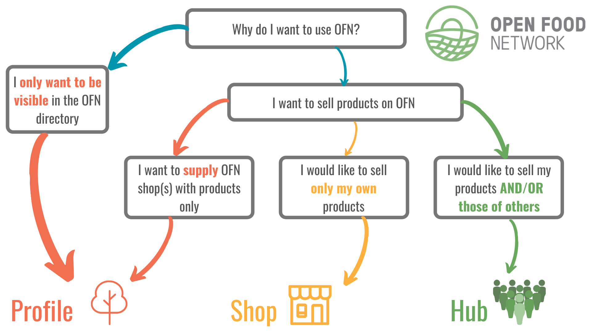

# Como a sua iniciativa pode usufruir da OFB?

Para cada tipo de atividade, a plataforma funciona de maneiras diferentes.

Nós classificamos as atividades em 3 categorias: [Perfil Simples](https://app.gitbook.com/@ofn-brasil/s/guide-ofn/~/drafts/-M1agwj8wgQ-HECDEnOf/your-quick-start-on-ofn-given-who-you-are#profile/@drafts), [Lojas](https://app.gitbook.com/@ofn-brasil/s/guide-ofn/~/drafts/-M1agwj8wgQ-HECDEnOf/your-quick-start-on-ofn-given-who-you-are#shop/@drafts) ou [Centrais](https://app.gitbook.com/@ofn-brasil/s/guide-ofn/~/drafts/-M1agwj8wgQ-HECDEnOf/your-quick-start-on-ofn-given-who-you-are#hub/@drafts):

_A flexibilidade da OFB permite que você troque de Perfil Simples para Loja ou Central \(e vice versa\) de acordo com as necessidades da sua atividade._ 

## Central


Feiras de produtores, sacolões, cooperativas, grupos de compras, vendedores por atacado, esquemas de assinaturas de cestas, CSAs, etc...


Uma Central pode tomar vários nomes e formas mas, resumindo, uma iniciativa é classificada como 'Central' se ela deseja vender produtos de terceiros. Você pode vender os seus produtos em conjunto com os produtos de outros agricultores ou produtores \(Centrais de Produtores\) ou funcionar apenas como um distribuidor de mercadorias fornecidas por terceiros \(Centrais de Não-Produtores\).


Se você prefere vender produtos que somente você produz, então o perfil '[Loja](https://app.gitbook.com/@ofn-brasil/s/guide-ofn/~/drafts/-M1agwj8wgQ-HECDEnOf/your-quick-start-on-ofn-given-who-you-are#shop/@drafts)' é o mais adequado para você.


### Como a OFB pode ajudar sua Central a crescer:

1. Aumentando sua visibilidade e alcance na internet.
2. Fornecendo ao seu cliente uma experiência de feira livre 'virtual'.
3. Facilitando os processos de gestão com relatórios financeiros, de pedidos, estoque - tudo em um só lugar. 
4. Permitindo que você aceite pedidos periodicamente, em ciclos, da maneira que melhor se adeque ao seus processos de produção e entrega.
5. Te ajudando a organizar pedidos repetidos regularmente, como esquemas de assinaturas de cestas. 
6. Ajudando a construir uma rede robusta de relacionamento entre produtores e iniciativas locais.

_Um perfil de 'Central' tem a maior flexibilidade entre os três tipos de perfis oferecidos pela OFB._

**É muito fácil criar seu perfil na na OFB:** siga os 5 passos descritos no nosso [guia de início rápido](https://app.gitbook.com/@ofn-brasil/s/guide-ofn/~/drafts/-M1agwj8wgQ-HECDEnOf/quick-start-guides/multi-producers-shop-hub-quick-setup-guide/@drafts). 

## Loja


Agricultores, Padeiros, Apicultores, Artesãos, etc...


Uma Loja pode ter muitas formas e nomes mas, resumindo, uma iniciativa é classificada como 'Loja' se ela desejar **vender** _**somente**_ **produtos que ela mesma produz.** 


Se você deseja vender produtos fornecidos por outros produtores além de você, então é necessário que você se registre com um perfil de '[CentraI](https://app.gitbook.com/@ofn-brasil/s/guide-ofn/~/drafts/-M1agwj8wgQ-HECDEnOf/your-quick-start-on-ofn-given-who-you-are#hub/@drafts)'. 


Como uma Loja; além de vender seus produtos online, você também pode fornecer produtos para outros distribuidores \(Centrais\) ativos na plataforma. .


Se você preferir não vender diretamente a seus consumidores, mas **apenas** fornecer produtos para uma Central, então o [Perfil Simples](https://app.gitbook.com/@ofn-brasil/s/guide-ofn/~/drafts/-M1agwj8wgQ-HECDEnOf/your-quick-start-on-ofn-given-who-you-are#profile/@drafts) é o melhor perfil para você.


### Como a OFB pode ajudar sua Loja a crescer:

1. Aumentando sua visibilidade e alcance na internet.
2. Streamlining your admin tasks with stock levels, orders, finances, packing reports all in one place.
3. Permitindo que você aceite pedidos periodicamente, em ciclos, da maneira que melhor se adeque ao seus processos de produção e entrega.
4. Ajudando a construir uma forte rede de relacionamento entre você e os distribuidores locais.

**É muito fácil criar seu perfil na na OFN:** siga os 5 passos descritos no nosso [guia de início rápido](https://app.gitbook.com/@ofn-brasil/s/guide-ofn/~/drafts/-M1agwj8wgQ-HECDEnOf/quick-start-guides/multi-producers-shop-hub-quick-setup-guide/@drafts). 

## Perfil Simples


Agricultores, Apicultores, Padeiros, Artesãos...


O 'Perfil Simples' foi feito para os produtores que preferem se concentrar no trabalho de produção do que na gestão de uma loja online.

Este tipo de perfil é ideal para aumentar a visibilidade online dos produtores e ao mesmo tempo conectá-los aos distribuidores \(Centrais\) locais, que podem servir se ocupar da gestão das vendas. 


Se você prefere gerenciar suas vendas você mesmo, então os perfis '[Loja](https://app.gitbook.com/@ofn-brasil/s/guide-ofn/~/drafts/-M1agwj8wgQ-HECDEnOf/your-quick-start-on-ofn-given-who-you-are#shop/@drafts)' ou '[Central](https://app.gitbook.com/@ofn-brasil/s/guide-ofn/~/drafts/-M1agwj8wgQ-HECDEnOf/your-quick-start-on-ofn-given-who-you-are#hub/@drafts)' podem atender melhor as suas necessidades. 


### Como a OFB pode ajudar a sua atividade:

1. Aumentando sua visibilidade online.
2. Ajudando a construir uma forte rede de relacionamento entre você e os distribuidores locais, para os quais você pode fornecer seus produtos.

**É muito fácil criar seu perfil na na OFB:** siga os 4 passos descritos no nosso [guia de início rápido. ](https://app.gitbook.com/@ofn-brasil/s/guide-ofn/~/drafts/-M1agwj8wgQ-HECDEnOf/quick-start-guides/profile-only-quick-setup-guide/@drafts)

